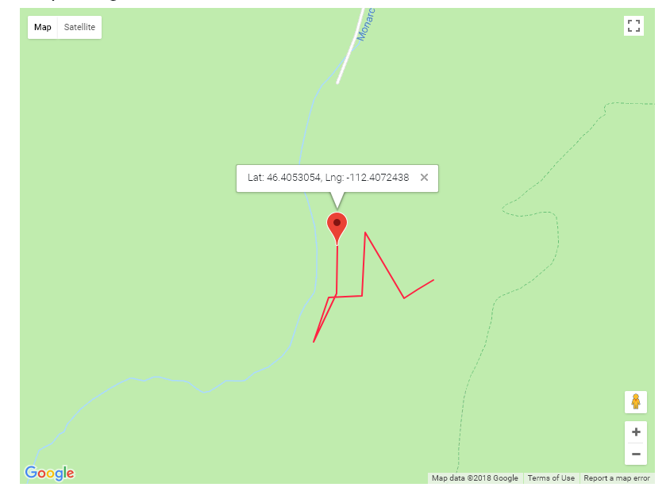

Map Widget
----------

.. note:: This widget uses Google Maps API. You must include this API in your html page.

Code:

.. code-block:: javascript

    widgets.map(dom_id, sensor_id):

First parameter is DOM ID in your html and second is Sensor ID to get data from.

Example:

.. code-block:: html

    
    <link href="build/css/index.min.css" rel="stylesheet">
    

    

    

    

It will look like this:

