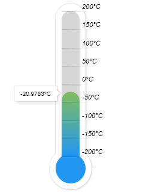

Thermometer Widget
------------------

Code:

.. code-block:: javascript

    widgets.thermometer(dom_id, sensor_id):

First parameter is DOM ID in your html and second is Sensor ID to get data from.

Example:

.. code-block:: html

    <link href="build/css/index.min.css" rel="stylesheet">
    

    

    

    

It will look like this:

